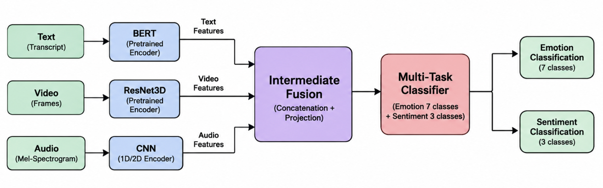

# Multimodal Emotion Detection

A trimodal (text + video + audio) emotion and sentiment classification system, trained on the MELD benchmark. This project investigates whether fusing text, video, and audio signals outperforms any single modality alone for emotion recognition in conversational speech.

## Overview

Human emotional expression is inherently multimodal — conveyed through words, facial expression, and vocal tone simultaneously. This project builds a fusion architecture that combines all three channels and evaluates it against unimodal baselines on the MELD dataset.

- **Text:** BERT (`bert-base-uncased`), frozen backbone
- **Video:** ResNet3D-18, pretrained on Kinetics-400, frozen backbone
- **Audio:** Custom 1D CNN over mel-spectrograms, trained from scratch (no pretrained audio backbone used)
- **Fusion:** Intermediate fusion — modality embeddings concatenated after encoding, before classification
- **Tasks:** Joint multi-task prediction — 7-class emotion + 3-class sentiment, trained together via a combined cross-entropy loss

## Dataset

[MELD](https://affective-meld.github.io/) (Multimodal EmotionLines Dataset) — sourced from *Friends* TV show dialogues.

| Split | Utterances |
|---|---|
| Train | 9,989 |
| Validation | 1,109 |
| Test | 2,610 |

- **Emotion labels (7-class):** anger, disgust, fear, joy, neutral, sadness, surprise
- **Sentiment labels (3-class):** negative, neutral, positive
- **Note:** MELD's emotion distribution is imbalanced (heavily skewed toward "neutral"), which is why weighted precision/F1 is used alongside accuracy for evaluation.
- Official MELD train/val/test splits are used as-is, for comparability with published benchmarks. No custom re-splitting was performed.

Raw dataset (~10GB video + audio) is expected in the following structure:
```
MELD.Raw/
├── train/
│   ├── train_sent_emo.csv
│   └── train_splits/            (.mp4 files)
├── dev_sent_emo.csv
├── dev/
│   └── dev_splits_complete/     (.mp4 files)
├── test_sent_emo.csv
└── test/
    └── output_repeated_splits_test/  (.mp4 files)
```

## Architecture


### Text Encoder
- `bert-base-uncased`, weights frozen (`requires_grad = False`)
- Input tokenized to fixed length 128 (padding + truncation)
- `[CLS]` pooled output (768-dim) → linear projection → 128-dim embedding

### Video Encoder
- `r3d_18`, pretrained on Kinetics-400, weights frozen
- 30 frames sampled per clip (padded with black frames if the clip is shorter), resized to 224×224, normalized
- Custom head: `Linear(512→128) → ReLU → Dropout(0.2)`

### Audio Encoder
- Randomly initialized 1D CNN (not pretrained — no strong pretrained audio backbone used)
- Input: mel-spectrogram, 64 mel bins, padded/truncated to 300 time steps
- Two conv blocks (64→128 channels) + adaptive pooling → projection head to 128-dim

### Fusion & Classification
- Three 128-dim embeddings concatenated → 384-dim vector
- Fusion layer: `Linear(384→256) → BatchNorm → ReLU → Dropout(0.3)`
- Two independent classifier heads on top of the shared 256-dim fused representation:
  - Emotion: `Linear(256→64) → ReLU → Dropout(0.2) → Linear(64→7)`
  - Sentiment: `Linear(256→64) → ReLU → Dropout(0.2) → Linear(64→3)`

**Why intermediate fusion:** preserves each modality's specialized representation while still letting the model learn cross-modal interactions before the final decision — unlike early fusion (raw input concatenation) or late fusion (combining independent per-modality predictions).

**Why frozen backbones:** standard transfer learning approach given the limited size of MELD relative to what BERT/ResNet3D were originally pretrained on; also keeps training feasible within free-tier GPU compute limits.

## Data Preprocessing

- **Text:** BERT WordPiece tokenization, fixed length 128, attention mask generated for padding.
- **Video:** Frames extracted via OpenCV, resized to 224×224, normalized to [0,1], padded/truncated to exactly 30 frames per clip.
- **Audio:** Extracted from the video file via `ffmpeg` (mono, 16kHz, PCM), converted to a mel-spectrogram via `torchaudio`, normalized, padded/truncated to 300 time steps.
- **Corrupt file handling:** `MELDDataset.__getitem__` wraps all processing in a try/except; failed samples (corrupt video, missing file) are logged and return `None`, filtered out by a custom `collate_fn` before batching — so a small number of known-corrupt files in the raw MELD release don't crash training.

## Training Setup

| Component | Value |
|---|---|
| Optimizer | Adam, weight decay 1e-5 |
| Text encoder LR | 8e-6 |
| Video/Audio encoder LR | 8e-5 |
| Fusion / classifier LR | 5e-4 |
| LR scheduler | `ReduceLROnPlateau` (factor 0.1, patience 2) |
| Loss | Cross-entropy (emotion + sentiment), label smoothing 0.05 |
| Gradient clipping | max norm 1.0 |
| Batch size | 16 |
| Epochs | up to 17 (best-val-loss checkpointing) |

**Differential learning rates:** pretrained encoders use small LRs to avoid overwriting useful pretrained knowledge (catastrophic forgetting); fusion/classifier layers use a larger LR since they start from random initialization and need bigger updates to learn.

**Multi-task loss:** `total_loss = emotion_loss + sentiment_loss`, backpropagated jointly in a single pass — shared encoder/fusion layers receive gradient signal from both tasks simultaneously.

**Checkpointing:** best model (by validation loss) is saved during training, not necessarily the final epoch, to avoid keeping an overfit late-stage model.

## Infrastructure

- Trained on **Kaggle Notebooks** (T4 GPU, free tier) — no local GPU available.
- Dataset hosted as a Kaggle Dataset, accessed read-only at `/kaggle/input/`.
- Code cloned from GitHub into each session (`/kaggle/working/`), since Kaggle session storage does not persist across sessions.

## Results (in progress)

A 17-epoch run (batch size 16) showed a consistent downward loss trend and improving validation metrics:

| Epoch | Val Emotion Acc | Val Sentiment Acc |
|---|---|---|
| 1 | 51.5% | 59.5% |
| 8 | 56.3% | 64.3% |
| 13 | 57.1% | 66.2% |
| 17 | 55.4% | 64.6% |

*(Full unimodal-vs-multimodal ablation comparison — the core hypothesis test — is a planned next step: training text-only, video-only, and audio-only baselines under identical conditions and comparing against the fusion model above.)*

